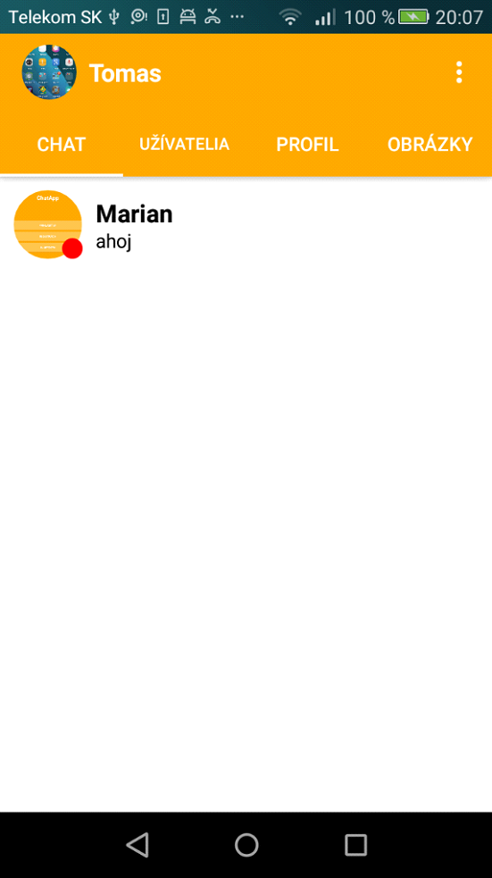
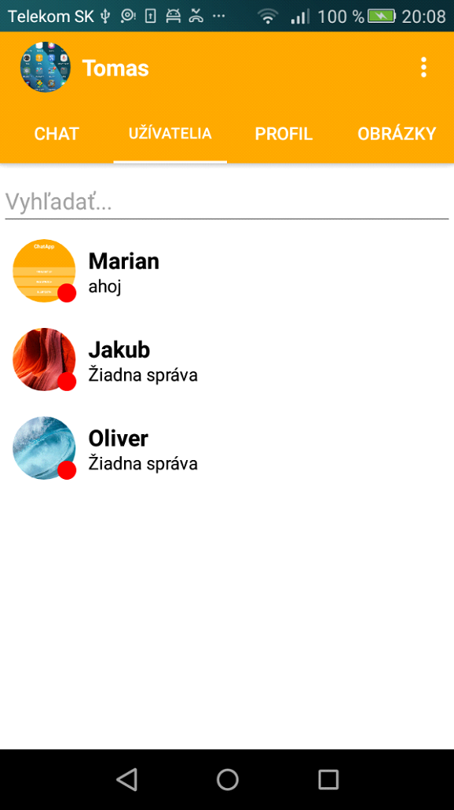
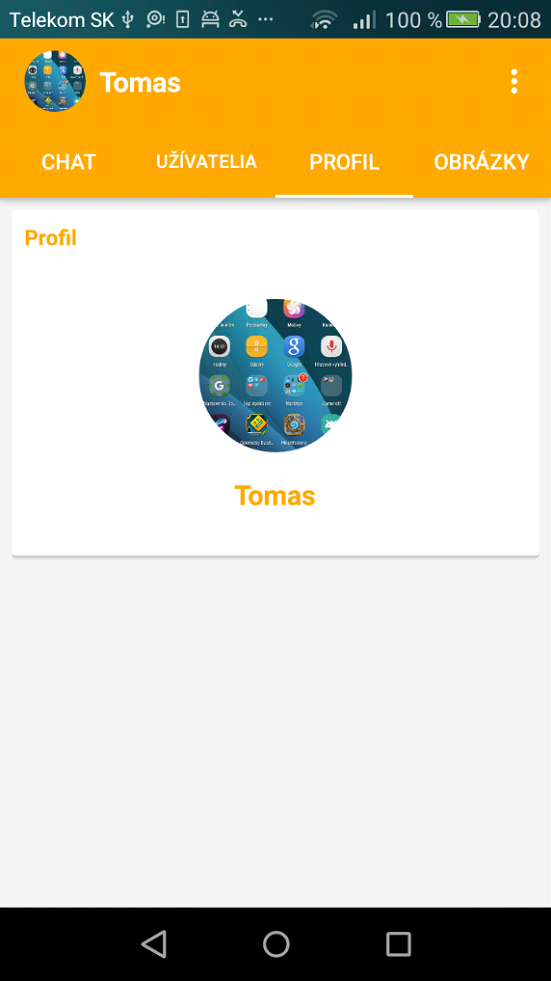
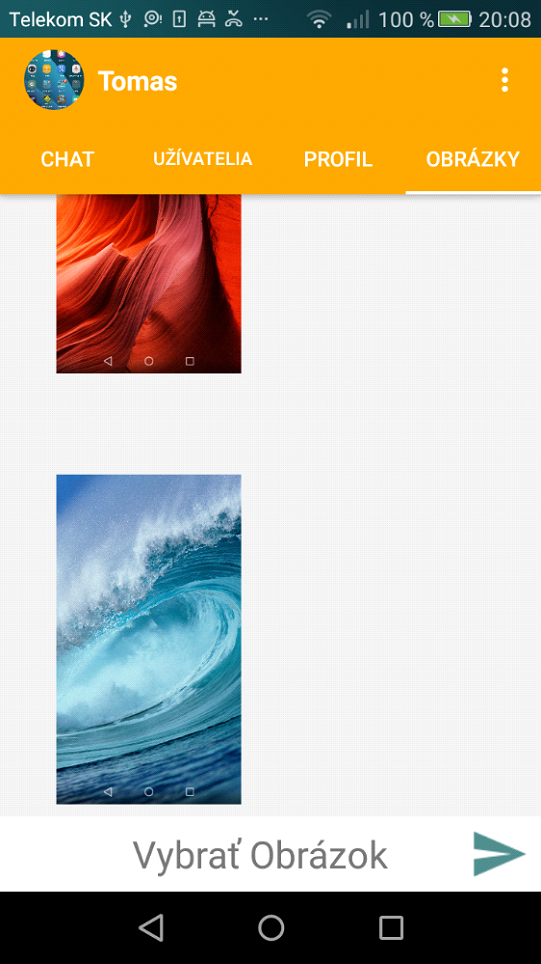

# ChatApp

## Úvod

Cieľom tejto práce bolo vytvoriť aplikáciu pre platformu Android, ktorá dokáže medzi užívateľmi posielať správy v peknom grafickom, interaktívnom prostredí. Užívateľ si vytvorí svoje vlastné konto, ktoré bude používať. Správu môže poslať vybranému užívateľovi zo zoznamu registrovaných užívateľov. Po kliknutí na daného užívateľa sa zobrazí história chatu s daným užívateľom, pole pre napísanie správy a tlačidlo pre odoslanie správy.

Užívateľ si takisto môže zmeniť svoj profilový obrázok. Ak má užívateľ nejaké neprečítané správy, zobrazí sa mu ich počet. Užívatelia môžu takisto posielať obrázky do zoznamu pre všetkých užívateľov. Aplikácia dokáže zistiť, či užívateľ danú správu videl a zobrazí sa mu zoznam užívateľov, s ktorými má začatú konverzáciu. Aplikácia umožňuje aj offline posielanie správ pomocou Bluetooth.

---

## Stanovenie cieľov práce

### Hlavné ciele
- Sprostredkovanie konverzácie medzi dvoma užívateľmi
- Vytvoriť jednoduché a príjemné grafické prostredie
- Možnosť zmeny profilového obrázka
- Komunikácia prostredníctvom Bluetooth
- Online alebo offline status užívateľa

### Vedľajšie ciele
- Zobrazenie počtu neprečítaných správ
- Umožniť posielanie obrázkov
- Umožniť posielanie súborov
- Zobrazenie poslednej správy
- Zobrazenie, či si daný užívateľ prečítal poslednú správu

---

## Teoretické východiská práce

### Vývojové nástroje

#### Android Studio
Android Studio je oficiálne vývojové prostredie pre operačný systém Android, postavené na IntelliJ IDEA. Podporuje jazyky Java, C++ a Kotlin a umožňuje vytváranie virtuálnych zariadení (emulátorov).

#### Firebase
Firebase je platforma na vývoj mobilných a webových aplikácií. Medzi hlavné služby patria:
- Firebase Realtime Database
- Firebase Authentication
- Firebase Storage

---

## Vlastné riešenie

Aplikácia bola vytvorená pre operačný systém Android a je napísaná v programovacom jazyku Java. Využíva online služby Firebase a umožňuje komunikáciu medzi užívateľmi cez internet alebo Bluetooth.

---

## Prihlásenie a registrácia užívateľa

Po spustení aplikácie sa zobrazí aktivita s tromi tlačidlami: prihlásenie, registrácia a Bluetooth. Registrácia vyžaduje meno, email a heslo. Autentifikácia je zabezpečená pomocou Firebase Authentication.

---

## Toolbar

Toolbar obsahuje:
- profilový obrázok užívateľa
- meno užívateľa
- menu ikonu (odhlásenie)

Profilový obrázok a meno sa načítavajú z Firebase databázy.

---

## Panel Chat

Panel Chat je vytvorený pomocou Fragmentu a slúži na zobrazenie zoznamu užívateľov, s ktorými má užívateľ aktívnu konverzáciu.

---

## Panel Užívatelia

Zobrazuje zoznam všetkých registrovaných užívateľov okrem aktuálne prihláseného. Obsahuje vyhľadávacie pole na filtrovanie užívateľov.

---

## Panel Profil

Obsahuje profilový obrázok a meno užívateľa. Umožňuje zmenu profilového obrázka uloženého vo Firebase Storage.

---

## Panel Obrázky

Slúži na zdieľanie obrázkov medzi všetkými užívateľmi. Obrázky sa ukladajú do Firebase Storage a ich URL adresy do databázy.

---

## Užívateľ v zozname

V zozname sa zobrazuje:
- meno užívateľa
- profilový obrázok
- online/offline status
- posledná správa
- stav správy (videné / doručené)

---

## Chatovacia Aktivita

Slúži na priamu komunikáciu medzi dvoma užívateľmi. Správy sa ukladajú do Firebase databázy a obsahujú informáciu o odosielateľovi, prijímateľovi a stave prečítania.

---

## Posielanie správ pomocou Bluetooth

Aplikácia umožňuje offline komunikáciu pomocou Bluetooth. Zariadenia sa musia spárovať a správy sa zobrazujú v zozname správ.

---

## Diskusia výsledkov

Aplikácia splnila všetky hlavné ciele a väčšinu vedľajších cieľov. Bola úspešne testovaná na viacerých Android zariadeniach. Do budúcna je možné rozšírenie o notifikácie, posielanie súborov, emotikony či hlasové a video hovory.

---

## Záver

Práca mala veľký prínos pre rozvoj programátorských schopností a lepšie pochopenie tvorby komplexných Android aplikácií.

